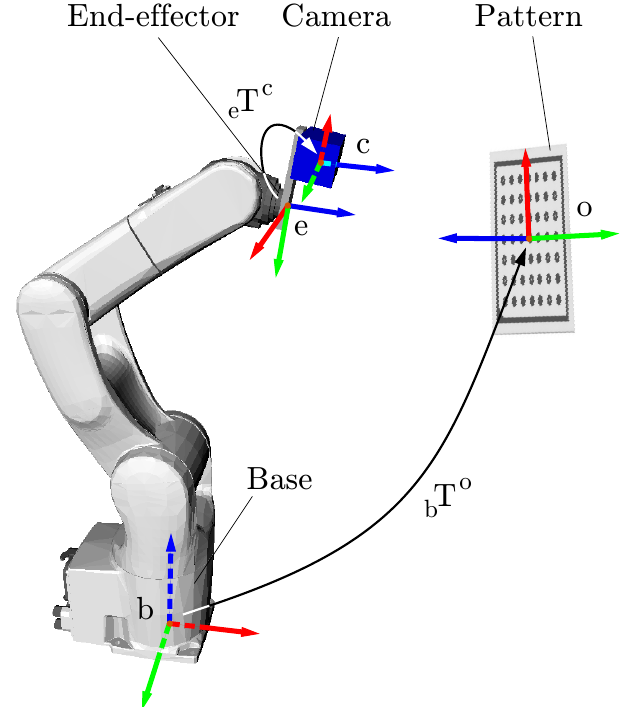
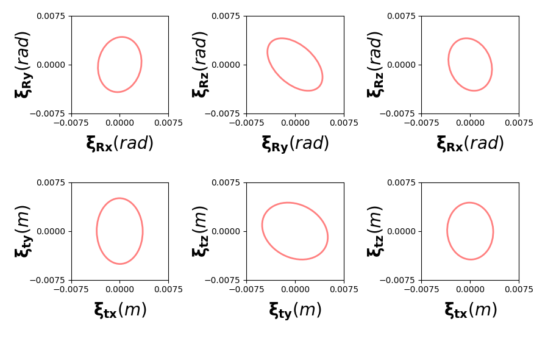

For basic usage, please refer to the [wiki page](https://github.com/dinhhuy2109/python-cope/wiki)

<!---
# Basic usage
## On the covariance of X in the AX=XB
The classical hand-eye calibration problem consists in identifying the rigidbody
transformation eTc between a camera mounted on the end-effector of
a robot and the end-effector itself (see the below figure). The problem is usually framed as the AX=XB problem. In this functionality, we provide a solution not only solving for X but also predicting the covariance of X from those of A and B, where A and B are now randomly perturbed transformation matrices. 

For more details, please refer to the accompanying paper [On the covariance of X in the AX=XB](https://arxiv.org/pdf/1706.03498.pdf).

<p align="center">
  
</p>

The following code snippets shows basic usage of `cope` in finding the covariance of X:

First, import necessary functions
```python
import cope.SE3lib as SE3
import cope.axxbcovariance as axxb
import numpy as np
import pickle
import matplotlib.pyplot as plt
```

Then, input As, Bs and their covariance matrices.
```python
# Read data files
filename = "data/pattern_tfs"
pattern_tfs =  pickle.load(open( filename, "rb" ) )
filename = "data/robot_tfs"
robot_tfs =  pickle.load(open( filename, "rb" ) )
ksamples = 30
# Randomly generate 30 pairs of A and B
datasize = len(pattern_tfs)
alpha = []
beta = []
ta = []
tb = []
for i in range(ksamples):
  # note this
  rand_number_1 = int(np.random.uniform(0,datasize))
  rand_number_2 = int(np.random.uniform(0,datasize))
  while rand_number_1==rand_number_2:
    rand_number_2 = int(np.random.uniform(0,datasize))
  A = np.dot(robot_tfs[rand_number_1],np.linalg.inv(robot_tfs[rand_number_2]))
  B = np.dot(pattern_tfs[rand_number_1],np.linalg.inv(pattern_tfs[rand_number_2]))
  alpha.append(SE3.RotToVec(A[:3,:3]))
  beta.append(SE3.RotToVec(B[:3,:3]))
  ta.append(A[:3,3])
  tb.append(B[:3,3])

# Covariances
sigmaA = 1e-10*np.diag((1, 1, 1, 1, 1, 1))
sigmaRa = sigmaA[3:,3:]
sigmata = sigmaA[:3,:3]
sigmaRb = np.array([[  4.15625435e-05,  -2.88693145e-05,  -6.06526440e-06],
                    [ -2.88693145e-05,   3.20952008e-04,  -1.44817304e-06],
                    [ -6.06526440e-06,  -1.44817304e-06,   1.43937081e-05]])
sigmatb = np.array([[  1.95293655e-04,   2.12627214e-05,  -1.06674886e-05],
                    [  2.12627214e-05,   4.44314426e-05,   3.86787591e-06],
                    [ -1.06674886e-05,   3.86787591e-06,   2.13069579e-05]])
```

Finally, solve with `cope` 
```python
Rxinit,txinit = axxb.FCParkSolution(alpha,beta,ta,tb) # Initial guess
Rxhat, sigmaRx, rot_converged = axxb.IterativeSolutionRot(beta,alpha,sigmaRa,sigmaRb,Rxinit)
txhat, sigmatx, trans_converged = axxb.IterativeSolutionTrans(beta, alpha, ta, tb, Rxhat, sigmaRa, sigmaRb, sigmata, sigmatb, sigmaRx, txinit.reshape((3,1)), 10)
# Visualization
axxb.VisualizeCovariances(sigmaRx,sigmatx,-0.01*0.75,0.01*0.75,-0.01*0.75,0.01*0.75)
plt.show(True)
```
This figure should appear!It shows the projections of the one-standard-deviation covariance ellipsoids.

<p align="center">
  
</p>

For more examples, please see the /examples folder
-->
